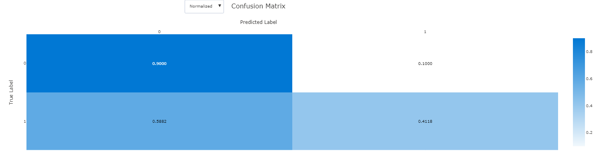

# Survival prediction after bone marrow transplantation

In this project I analyze a real world medical dataset and try to train a machine learning model that predicts the
specific target correctly. The Dataset details are in the next section. For model training Microsoft Azure is used. 
On the one hand there is a sklearn model with optimized hyperparameters by HyperDrive, on the other hand there is a 
trained AutoML model. Both models will be compared and the better one will be deployed as a webservice for inference
purposes.

## Project Set Up and Installation
This project was realized in Microsoft Azure Machine Learning studio
[link azure machine learning](https://azure.microsoft.com/de-de/free/services/machine-learning/). The project itself
is splitted in a [hyperparameter tuning notebook](hyperparameter_tuning.ipynb) and an 
[AutoML training and model deployment notebook](automl.ipynb).  

## Dataset

The chosen dataset is: __Bone marrow transplant: children Data set__ and can be found on [UCI](https://archive.ics.uci.edu/ml/datasets/Bone+marrow+transplant%3A+children#). Currently the dataset can't be downloaded directly form this site, I got it from the developers.

The source is owned by:

Marek Sikora (marek.sikora '@' polsl.pl), Lukasz Wróbel (lukasz.wrobel '@' polsl.pl), Adam Gudys´› (adam.gudys '@' polsl.pl)
Faculty of Automatic Control, Electronics and Computer Science, Silesian University of Technology, 44-100 Gliwice, Poland 
 
The relevant Paper is:

Sikora, M, Wróbel, L, Gudys´›, A (2019) GuideR: a guided separate-and-conquer rule learning in classification, regression, and survival settings,
Knowledge-Based Systems, 173:1-14 ([Web Link](https://www.sciencedirect.com/science/article/abs/pii/S0950705119300802?via%3Dihub))
 

### Overview

##### Data Set Information [[cited from here](https://archive.ics.uci.edu/ml/datasets/Bone+marrow+transplant%3A+children#)]

The data set describes pediatric patients with several hematologic diseases: malignant disorders
(i.a. acute lymphoblastic leukemia, acute myelogenous leukemia, chronic myelogenous leukemia, myelodysplastic syndrome) and nonmalignant cases (i.a. severe aplastic anemia, Fanconi anemia, with X-linked adrenoleukodystrophy). All patients were subject to the unmanipulated allogeneic unrelated donor hematopoietic stem cell transplantation.

The motivation of the study was to identify the most important factors influencing the success or failure of the
transplantation procedure. In particular, the aim was to verify the hypothesis that increased dosage of
CD34+ cells / kg extends overall survival time without simultaneous occurrence of undesirable events affecting patients' quality of life ([Kalwak et al., 2010](https://www.bbmt.org/article/S1083-8791(10)00148-5/fulltext)).

The data set has been used in our work concerning survival rules
([Wróbel et al., 2017](https://bmcbioinformatics.biomedcentral.com/articles/10.1186/s12859-017-1693-x))
and user-guided rule induction ([Sikora et al., 2019](https://www.sciencedirect.com/science/article/abs/pii/S0950705119300802?via%3Dihub)).
The authors of the research on stem cell transplantation ([Kalwak et al., 2010](https://www.bbmt.org/article/S1083-8791(10)00148-5/fulltext)) who inspired our study also contributed to the set.

### Task

In this project a model is developed that can predict the _survival_status_ based on the given dataset parameters. For this,
Azure Machine Learning is used to train a LogisticRegression model (optimized with Hyperdrive) and parallel get a optimized 
AutoML model. [AutoML](https://docs.microsoft.com/en-us/azure/machine-learning/concept-automated-ml) offers the great
possibility to explore the model and get insights which parameters are most important and how they are distributed. It's
very interesting to check out if the above mentioned CD34+ cells/kg parameter has a big influence on the model.

### Access

The original provided dataset is an arff file from that I extracted the content and created a cvs dataset. Both files 
are in the dataset folder. To access the csv file in the code I use the "global" path.

```
dataset_path = 'https://raw.githubusercontent.com/PhilippRamjoue/Leukemia_Classification/main/dataset/bone-marrow-dataset.csv'

ds = Dataset.Tabular.from_delimited_files(path=dataset_path)
```

### Dataset Exploration

First thing to do is to explore the dataset. Following 39 categories are provided:

- __donor_age__ - Age of the donor at the time of hematopoietic stem cells apheresis
- __donor_age_below_35__ - Is donor age less than 35 (yes, no)
- __donor_ABO__ - ABO blood group of the donor of hematopoietic stem cells (0, A, B, AB)
- __donor_CMV__ - Presence of cytomegalovirus infection in the donor of hematopoietic stem cells prior to transplantation (present, absent)
- __recipient_age__ - Age of the recipient of hematopoietic stem cells at the time of transplantation
- __recipient_age_below_10__ - Is recipient age below 10 (yes, no)
- __recipient_age_int__ - Age of the recipient discretized to intervals (0,5], (5, 10], (10, 20]
- __recipient_gender__ - Gender of the recipient (female, male)
- __recipient_body_mass__ - Body mass of the recipient of hematopoietic stem cells at the time of the transplantation
- __recipient_ABO__ - ABO blood group of the recipient of hematopoietic stem cells (0, A, B, AB)
- __recipient_rh__ - Presence of the Rh factor on recipient’s red blood cells (plus, minus)
- __recipient_CMV__ - Presence of cytomegalovirus infection in the donor of hematopoietic stem cells prior to transplantation (present, absent)
- __disease__ - Type of disease (ALL, AML, chronic, nonmalignant, lymphoma)
- __disease_group__ - Type of disease (malignant, nonmalignant)
- __gender_match__ - Compatibility of the donor and recipient according to their gender (female to male, other)
- __ABO_match__ - Compatibility of the donor and the recipient of hematopoietic stem cells according to ABO blood group (matched, mismatched)
- __CMV_status__ - Serological compatibility of the donor and the recipient of hematopoietic stem cells according to cytomegalovirus infection prior to transplantation (the higher the value, the lower the compatibility)
- __HLA_match__ - Compatibility of antigens of the main histocompatibility complex of the donor and the recipient of hematopoietic stem cells (10/10, 9/10, 8/10, 7/10)
- __HLA_mismatch__ - HLA matched or mismatched
- __antigen__ - In how many antigens there is a difference between the donor and the recipient (0-3)
- __allel__ - In how many allele there is a difference between the donor and the recipient (0-4)
- __HLA_group_1__ - The difference type between the donor and the recipient (HLA matched, one antigen, one allel, DRB1 cell, two allele or allel+antigen, two antigenes+allel, mismatched)
- __risk_group__ - Risk group (high, low)
- __stem_cell_source__ - Source of hematopoietic stem cells (peripheral blood, bone marrow)
- __tx_post_relapse__ - The second bone marrow transplantation after relapse (yes ,no)
- __CD34_x1e6_per_kg__ - CD34kgx10d6 - CD34+ cell dose per kg of recipient body weight (10^6/kg)
- __CD3_x1e8_per_kg__ - CD3+ cell dose per kg of recipient body weight (10^8/kg)
- __CD3_to_CD34_ratio__ - CD3+ cell to CD34+ cell ratio
- __ANC_recovery__ - Neutrophils recovery defined as neutrophils count >0.5 x 10^9/L (yes, no)
- __time_to_ANC_recovery__ - Time in days to neutrophils recovery
- __PLT_recovery__ - Platelet recovery defined as platelet count >50000/mm3 (yes, no)
- __time_to_PLT_recovery__ - Time in days to platelet recovery
- __acute_GvHD_II_III_IV__ - Development of acute graft versus host disease stage II or III or IV (yes, no)
- __acute_GvHD_III_IV__ - Development of acute graft versus host disease stage III or IV (yes, no)
- __time_to_acute_GvHD_III_IV__ - Time in days to development of acute graft versus host disease stage III or IV
- __extensive_chronic_GvHD__ - Development of extensive chronic graft versus host disease (yes, no)
- __relapse__ - Relapse of the disease (yes, no)
- __survival_time__ - Time of observation (if alive) or time to event (if dead) in days
- __survival_status__ - Survival status (0 - alive, 1 - dead)

In sum there are 189 entries with each 39 columns.

Exploring the dataset shows that there are cells with '?':

 

This 'nan' values have to be dropped for the model training.

### Dataset Insights

First test is to drop nan values without a deep data exploration:

```

dataset_path = 'https://raw.githubusercontent.com/PhilippRamjoue/Leukemia_Classification/main/dataset/bone-marrow-dataset.csv'

dataset = pd.read_csv(dataset_path, sep=',')

dropped_columns_frame = dataset.dropna(axis=1)

dropped_rows_frame = dataset.dropna(axis=0)
```

This dropping results in massive losses in the dataset:

- Shape of original frame: (187, 39)
- Shape of frame with dropped nan columns: (187, 24); Loss: 38 %
- Shape of frame with dropped nan rows: (27, 39); Loss: 85 %

This drop losses are definitely to massive. Next step is to get insights which columns have the most
'?' values:

```
# Convert ? to NaN values
for i in range(len(dataset)):
    for col in dataset:
        if dataset.at[i,col] == '?':
            dataset.at[i, col] = np.NaN

# check out columns with the most nan values
summed_nans_cols = (dataset.isna().sum()).sort_values(ascending=False)
```

The result is:

- time_to_acute_GvHD_III_IV    147
- extensive_chronic_GvHD        31
- time_to_PLT_recovery          17
- CMV_status                    16
- recipient_CMV                 14
- CD3_x1e8_per_kg                5
- time_to_ANC_recovery           5
- CD3_to_CD34_ratio              5
- recipient_body_mass            2
- donor_CMV                      2
- recipient_rh                   2
- allel                          1
- recipient_ABO                  1
- antigen                        1
- ABO_match                      1

__78 % of the 'time_to_acute_GvHD_III_IV ' data is nan!__ Dropping rows with NaN values would
result in a loss of 78% only because of this column. 

When evaluating the table, it is noticeable that many of the entries are _'time'_ or _'status'_ values.
Diving even deeper in the dataset shows that there a specific connections and correlation available:

#### time_to_acute_GvHD_III_IV

 

#### time_to_PLT_recovery

 

#### time_to_ANC_recovery

 

#### CMV_status

 

#### CD3_to_CD34_ratio

 

#### ABO_match

 

__Findings__

The _'time'_ columns have a connection to the specific related parameter column. If the related
parameter is not present there is also no _'time'_ available. Because of this the '?' value of the
related _'time'_ value can be set to 0. With this replacement the parameter can be used in the 
model.

The other three columns are values that are related to two conditions. If one condition is '?' the 
whole ratio is '?'. We can't replace a missing value in this case so rows with a '?' in this columns will
be dropped in the cleaning step.

For the column _'extensive_chronic_GvHD'_ no correlations could be found. Replacing a '?' with 'No'
is also not a good idea because we don't know if the values is really 'No' or simply missing.

After this dataset exploration the next step is cleaning and preparing the dataset for model development.

### Dataset cleaning

The specific clean function is in the [train.py](train.py) script and details can be seen there.

It's worth to mention that the initial cleaning function (Version 1) has been updated because of some side effects 
in the model training.

#### Version 1

In the first version 'clean_data' can be seen in the script [manual_test.py](manual_tests.py).

The specific models are explained in detail later. For now it's known that there was a earlier Hyperdrive run
(a sklearn LogisticRegression model) and an AutoML run.

The accuracy of the Hyperdrive run was __78%__:

 

The accuracy of the AutoML run was __93%__:

 


Both results are very good and the AutoML accuracy is even amazing but a deeper insight in the 
AutoML Explanations visualizes the problem:

 

The Parameter 'survival_time' has a massive impact on the model and needs a re-thinking of the usage.

#### Version 2

Checking out the parameters _'survival_time'_ and _'survival_status'_ shows that there is a correlation:

- __survival_time__ - Time of observation (if alive) or time to event (if dead) in days
- __survival_status__ - Survival status (0 - alive, 1 - dead)

The question of survival status is particularly interesting from a medical perspective. Because of this 
the data will be cleaned/transformed again:

    # With reference to the 5-years-survival rate in medical context there are 3 categories:
    # survival_status_0: still alive and over 5 years in observation
    survival_status_0: 36
    
    # survival_status_1: unfortunately dead
    survival_status_1: 85
    
    # survival_status_ongoing: still alive and under 5 years in observation
    survival_status_ongoing: 66
    
The rows in the category _'survival_status_ongoing'_ will be dropped because there is not a "final"
medical status available.

    # After dropping 'survival_status_ongoing'
    Shape of original frame: (121, 37)

    # After dropping/cleaning the dataset with the existing methodes of version 1
    Shape of frame with dropped nan rows: (104, 37); Loss: 14 %

Additionally the class labels are switched: alive = 1, dead = 0:

```
dataset['survival_status'] = dataset.survival_status.apply(lambda s: 0 if s == 1 else 1)

```
In the next sections the models itself are explained.

## Hyperparameter Tuning

As a model for Hyperparameter Tuning a sklearn LogisticRegression model is used because it is solid and 
robust. 

This [LogisticRegression](https://scikit-learn.org/stable/modules/generated/sklearn.linear_model.LogisticRegression.html)
model is trained with different hyperparameters C (Inverse of regularization strength) and
max_iter (Maximum number of iterations taken for the solvers to converge).

The hyperparameter tuning is executed with Azure [Hyperdrive package](https://docs.microsoft.com/en-us/python/api/azureml-train-core/azureml.train.hyperdrive?view=azure-ml-py). This tool provides the possibility to define the parameter search space, the metric and many more. The main task is to automate the hyperparameter search process.

To find the best LogisticRegression model the following Hyperdrive config is used:


```
hyperdrive_run_config = HyperDriveConfig(estimator=estimator,
                             hyperparameter_sampling=param_sampling,
                             policy=early_termination_policy,
                             primary_metric_name="accuracy",
                             primary_metric_goal=PrimaryMetricGoal.MAXIMIZE,
                             max_total_runs=50,
                             max_concurrent_runs=4)
```

 1. __estimator__
    To train the LogisticRegression model is useful to provide a training script (train.py). This script is executed
    by an [Estimator](https://docs.microsoft.com/en-us/python/api/azureml-train-core/azureml.train.estimator.estimator?view=azure-ml-py) object.

    ```
    script_parameter = {
        '--C': 1.0,
        '--max_iter': 100
    }
    
    #TODO: Create your estimator and hyperdrive config
    estimator = Estimator(source_directory='.',
                    script_params=script_parameter,
                    compute_target=cpu_cluster,
                    entry_script='train.py',
                    pip_packages=['sklearn'])
    ```
    
 2. __hyperparameter_sampling__
   
    To provide the different parameter spaces for the tuning a 
    [RandomParamterSampling](https://docs.microsoft.com/en-us/python/api/azureml-train-core/azureml.train.hyperdrive.randomparametersampling?view=azure-ml-py) object is used. Random sampling is a good start to explore the different parameter combinations and the range in which good values are possible. The next step would be to refine the search space to improve the results. 

    Other provided [algorithms](https://docs.microsoft.com/en-us/python/api/azureml-train-core/azureml.train.hyperdrive.hyperparametersampling?view=azure-ml-py) are Grid and Bayesian sampling. Grip sampling only works with discrete hyperparameters and is not suitable for my purposes because I have no good feeling with discrete C values to use. Additionally, Grid sampling could be very exhaustive. In the Bayesian sampling, the current samples are picked concerning the previous set and the performance. Because of this, the best results are achieved with a small number of concurrent runs. This could lead to an exhaustive and time-consuming tuning task.


    ```
    ps = RandomParameterSampling( {
            '--C': uniform(0.1, 1.0),
            '--max_iter': choice(10, 25, 50, 100, 1000)
        }
    )
    
    ```

    The Object uses uniform distributed values in the range 0.1 to 1.0 for the C parameter and fixed values of choice for the maximum iterations for the solver.


 3. __policy__

    As an early terminating policy, the [BanditPolicy](https://docs.microsoft.com/en-us/python/api/azureml-train-core/azureml.train.hyperdrive.banditpolicy?view=azure-ml-py&preserve-view=true#&preserve-view=truedefinition) is chosen. With a small slack_factor, the policy is very aggressive and can save computing time. This is great for the start. 

    Other provided [policies](https://docs.microsoft.com/en-us/azure/machine-learning/how-to-tune-hyperparameters#early-termination) are Median stopping policy, Truncation selection policy and No termination policy (default). Median stopping can be used as a conservative policy and Truncation selection as an aggressive policy. No termination policy is no option because we want to save compute time.

    
    ``` 
    early_termination_policy = BanditPolicy(slack_factor = 0.1, evaluation_interval=1, delay_evaluation=5)

    ```

    The early termination policy is applied at every interval when metrics are reported, starting at evaluation interval 5. Any run whose best metric is less than (1/(1+0.1) or 91% of the best performing run will be terminated.

### Results

The Hyperdrive run was successful:

 

After 50 runs the best result is ~ 62% accuracy with the parameters C=0.101 and max_iter=1000.

 

As visible on the next picture most of the runs are around 59%. 

 

A deeper insight visualizes that C values in the range from 0.3 to 0.6, independent from the iterations, perform worse than 
the other C values. 

 

The similar accuracy values and the significant chart suggest that the model is not really suitable. 

 

In the next section the AutoML run is explained and hopefully better.

## Automated ML

First AutoML settings and an AutoML configuration are needed. It's a classification task that should be optimized
to best accuracy. The training data is the dataset incl. the label _'survival_status'_. Other settings are the experiment
timeout after 30 min, an iteration timeout after 5 min and a max. number of concurrent iterations. Because a compute
cluster with four nodes is used, four concurrent runs can be performed.

```
automl_settings = {'experiment_timeout_minutes':30,
                    'primary_metric':'accuracy',
                    'enable_early_stopping':True,
                    'n_cross_validations':5,
                    'max_concurrent_iterations':4
                    }

automl_config = AutoMLConfig(
    task="classification",
    compute_target=cpu_cluster,
    training_data=training_data,
    iterations=30,
    iteration_timeout_minutes=5,
    label_column_name='survival_status',
    **automl_settings
    )
```

### Results

The training results seem to be more realistic than the 92% of the first run. The best solution was a VotingEnsemble model
with ~74% accuracy. In other runs the Voting Ensemble model had ~77% that's also not bad and more realistic than 92%. 

 

 

This Ensemble algorithm combines several different algorithms and takes the majority of the votes.
The result is a very robust model. These are the chosen algorithms and their specific weights:

```
sgdclassifierwrapper, xgboostclassifier, extratreesclassifier, randomforestclassifier, sgdclassifierwrapper, randomforestclassifier, extratreesclassifier

0.14285714285714285, 0.14285714285714285, 0.14285714285714285, 0.14285714285714285, 0.14285714285714285, 0.14285714285714285, 0.14285714285714285
```
With the Azure SDK it's possible to get deeper insights in the VotingEnsemble model. Next cell visualizes details of
the xgboostclassifier (especially the hyperparameters) in the ensemble:

```
xgboostclassifier
{'base_score': 0.5,
 'booster': 'gbtree',
 'colsample_bylevel': 1,
 'colsample_bynode': 1,
 'colsample_bytree': 1,
 'gamma': 0,
 'learning_rate': 0.1,
 'max_delta_step': 0,
 'max_depth': 3,
 'min_child_weight': 1,
 'missing': nan,
 'n_estimators': 100,
 'n_jobs': 1,
 'nthread': None,
 'objective': 'binary:logistic',
 'random_state': 0,
 'reg_alpha': 0,
 'reg_lambda': 1,
 'scale_pos_weight': 1,
 'seed': None,
 'silent': None,
 'subsample': 1,
 'tree_method': 'auto',
 'verbose': -10,
 'verbosity': 0}

```

Also the other trained models in the AutoML run are in a similar range but almost all are better than the LogisticRegression model:

 

Checking out the explanations of the best model show interesting details:

 

The paper [Kalwak et al., 2010](https://www.bbmt.org/article/S1083-8791(10)00148-5/fulltext) present the hypothesis that
increased dosage of CD34+ cells / kg extends overall survival time without simultaneous occurrence of undesirable events affecting patients' quality of life.

It's visible, that the most important features of the AutoML model are 'relapse' and CD34_x1e6_per_kg. The next chart 
visualizes the distribution of the features:

 

The distribution of some features is a bit imbalanced but the CD34_x1e6_per_kg parameter is almost balanced. What's also
visible is the fact, that the predicted classes of the CD34_x1e6_per_kg are mixed. Compared with the relapse parameter the
CD34_x1e6_per_kg parameter can not reliably be linked to a class label.

The next step is to check out some metrics next to the accuracy score:

 

Especially for Precision-recall, ROC and Confusion a visualization is helpful:

#### ROC curve
 

Inspecting the chart shows that the ROC curve is not very good. The best configuration results in ~75% TPR 
(True-Positive-Rate) with ~25% FPR (False-Positive-Rate). One possible problem could the imbalance of the dataset with
36 class 1 labels (alive) and 85 class 0 labels (dead). 

A better metric for imbalanced datasets is the precision-recall chart. The FPR is replaced by precision because 
the number of True-Negatives (TN) is not part of the precision calculation. Thus Precision is independent of imbalanced 
data.

#### Precision Recall curve
 

The precision-recall chart looks a bit better but also not very good. To get a better feeling for the values the next
step is to inspect the confusion matrix that is the base for the metrics:

#### Confusion matrix
 

Checking out the matrix shows:

- True Positives (TP): 0.41
- False Negatives (FN): 0.59
- False Positives (FP): 0.1
- True Negatives (TN): 0.9 

#### What does this mean?

This means that the algorithm predicted 41% of the patient as alive that a really alive __BUT__ 59% as dead that are 
also alive. On the other side the model predicted 90% of dead patient correctly. This behaviour can be explained
by data distribution and the feature importance. 

 

The relapse feature has a very high importance and a clear distribution that results in very good results for prediction
of class 0 (dead). The other features like CD34_x1e6_per_kg, time_to_PLT_recovery and recipient_body_mass have class labels
in both distributions. A clear spearation is unfortunately not possible.
 
## Model Deployment

The comparison of the LogisticRegression and the AutoML accuracy show that the AutoML model has to be deployed. 

First the best model has to be registered:

```
model_name = best_run.properties['model_name']
print(model_name) # AutoML5579856fb28
automl_model= auto_run.register_model(model_name=model_name)
```
The registered models can be seen in the Machine Learning studio too.

 

After this a webservice has to be deployed. For this, an InferenceConfig with [scoring script](score.py) and an ACIWebService
configuration is needed:

```
inference_config = InferenceConfig(entry_script="score.py")

# Set deployment configuration
deployment_config = AciWebservice.deploy_configuration(cpu_cores = 1,
                                                       memory_gb = 1)

# Define the model, inference, & deployment configuration and web service name and location to deploy
service = Model.deploy(workspace = ws,
                       name = "webservice",
                       models = [automl_model],
                       inference_config = inference_config,
                       deployment_config = deployment_config)

service.wait_for_deployment(show_output=True)
```

After successful service deployment the service is also visible in the Machine Learning studio:

 

 

Checking out the experiment run in which the best model was found it's visible, that the model is "registered" and 
"deployed" as a webservice.

 

To test the webservice one possible is to run the service with test data:

```
df_test = training_data.to_pandas_dataframe()
y_test=df_test['survival_status']
x_test=df_test.drop(['survival_status'],axis=1)
print(y_test[1])

if service.state == 'Healthy':
    x_test_json = x_test[:1].to_json(orient='records')

    output = service.run(x_test_json)

    print(output) 
```

The result is correct:

 

## Screen Recording

Check out the following video to get an overview of the whole project and all parts.

[Screencast video](https://youtu.be/hg-IgL61zyU)

## Conclusion

It is possible to train an AutoML VotingEnsemble model with 74% accuracy on the dataset. The paper 
[Kalwak et al., 2010](https://www.bbmt.org/article/S1083-8791(10)00148-5/fulltext) present the hypothesis that
increased dosage of CD34+ cells / kg extends overall survival time without simultaneous occurrence of undesirable
events affecting patients' quality of life. The model explanation confirmed that the parameter CD34+ cells / kg has a very
big importance in the dataset. Unfortunately it was not possible to receive a good separation of the data 
regarding the CD34+ cells / kg parameter. This fact results in a 41% TP (True-Positive) value for predicting alive 
patient as alive. On the other side the most important dataset parameter is relapse. The data separation is very clear and
results in a TN (True-Negative) value of 90% for predicting a dead patient as dead. This results are a bit frustrating 
because my goal was to detect parameters that are important for survival and to train a model that performs well on them. 
In the end I think the dataset is also to small with only 104 rows and only 30% class 1 (alive) patient. A very important
feature with 70% of class 0 (dead) data results in a model that better predicts class 0.
